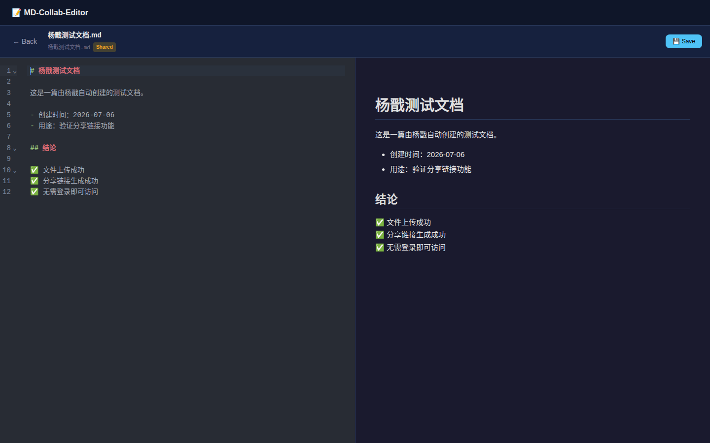

# MD-Collab-Editor

A lightweight, real-time Markdown collaboration editor with Git version management. Designed for seamless human-AI collaborative editing — agents can read, write, and manage Markdown files through a simple REST API while the web UI provides live preview and editing.

> 🌐 **Live demo**: [https://md.zeaho.site](https://md.zeaho.site)

## Features

- ✏️ **Rich Markdown editing** with CodeMirror 6 (syntax highlighting, line numbers, keybindings)
- 👁️ **Live preview** with markdown-it and highlight.js
- 🔄 **Real-time updates** via WebSocket — file changes appear instantly
- 📜 **Git version management** — every save is automatically committed
- 🤖 **Agent API** — AI agents can read/write files, create share links, and get real-time file change notifications
- 🔗 **Share links** — create time-limited, public share links for collaborators
- 🔐 **Token-based authentication** with optional password login
- 🐳 **Docker Compose** deployment with health checks
- 📁 **Auto file watching** — detect external file changes and broadcast them

## Screenshot



> Markdown editor (left) with live preview (right) in the MD-Collab-Editor web UI.

## Tech Stack

| Layer | Technology |
|-------|-----------|
| **Frontend** | Vue 3 + Vite, CodeMirror 6, markdown-it + highlight.js |
| **Backend** | Fastify (Node.js) |
| **Version Control** | Git via simple-git |
| **Database** | SQLite via better-sqlite3 |
| **Real-time** | WebSocket via @fastify/websocket |
| **File Watching** | chokidar |
| **Deployment** | Docker Compose |

## Quick Start

### Using Docker Compose (recommended)

```bash
# Clone the repository
git clone https://github.com/wutao667/md-collab-editor.git
cd md-collab-editor

# Set your access token
echo "ACCESS_TOKEN=your-secure-token" > .env

# Start
docker compose up -d --build

# Check logs
docker logs md-collab-editor
```

Visit `http://localhost:3000/?token=your-secure-token` in your browser.

### Development

```bash
# Terminal 1: Start the backend
cd server && npm install && npm run dev

# Terminal 2: Start the frontend dev server
cd client && npm install && npm run dev
```

Then open `http://localhost:5173/?token=xxx` (token is printed by the server).

## Authentication

### Token-based auth (default)

Set a fixed token in `.env`:

```env
ACCESS_TOKEN=your-secure-64-char-hex-token
```

If no token is set, a random 64-character hex token is generated on each startup and printed to the logs.

### Password login

Set an access password to enable the login page:

```env
ACCESS_PASSWORD=your-password
```

Default password (if not set): `wutao667`

### Query parameter

All API requests require the token as a query parameter: `?token=your-token`

## API

### File Management

| Method | Path | Description |
|--------|------|-------------|
| `GET` | `/api/health` | Health check (no auth) |
| `GET` | `/api/files` | List all `.md` files |
| `GET` | `/api/files/:id` | Get file metadata |
| `GET` | `/api/files/:id/content` | Get file content |
| `PUT` | `/api/files/:id` | Save/update file |
| `POST` | `/api/files` | Create a new file |
| `DELETE` | `/api/files/:id` | Delete a file |

All endpoints (except `/api/health`) require `?token=xxx` query parameter.

### Share Links

| Method | Path | Description |
|--------|------|-------------|
| `POST` | `/api/files/:id/share` | Create a public share link |
| `GET` | `/api/files/:id/share` | Get existing share link for a file |
| `DELETE` | `/api/files/:id/share` | Delete a share link |
| `GET` | `/api/share/:token` | Get file content via share token (no auth) |
| `PUT` | `/api/share/:token` | Update file content via share token (no auth) |

Share links allow anonymous collaborators to read and write files without authentication.

### WebSocket

`/ws?token=xxx` — Real-time notifications for file changes

Events:
- `file-changed` — A file was modified
- `file-created` — A new file was added
- `file-deleted` — A file was removed

### Agent API Usage

Agents can use the file API to manage Markdown documents:

```bash
# List files
curl "https://md.zeaho.site/api/files?token=YOUR_TOKEN"

# Read a file
curl "https://md.zeaho.site/api/files/my-doc.md/content?token=YOUR_TOKEN"

# Save/create a file
curl -X PUT "https://md.zeaho.site/api/files/my-doc.md?token=YOUR_TOKEN" \
  -H "Content-Type: application/json" \
  -d '{"content": "# New Document\n\nHello from agent!"}'

# Create a share link for public access
curl -X POST "https://md.zeaho.site/api/files/my-doc.md/share?token=YOUR_TOKEN"
```

## Usage

1. **Place files**: Put `.md` files in `data/repos/default/` or `agent-inbox/`
2. **Browse**: Open the web UI, you'll see a list of all `.md` files
3. **Preview**: Click any file to view rendered Markdown
4. **Edit**: Switch to Edit mode to modify content with CodeMirror
5. **Save**: Save changes — they're written to disk and committed to Git
6. **Real-time**: Files changed by agents are automatically detected and the UI updates via WebSocket

## Project Structure

```
md-collab-editor/
├── docker-compose.yml     # Docker Compose configuration
├── Dockerfile             # Multi-stage build
├── package.json           # Server dependencies
├── server/                # Fastify backend
│   ├── index.js           # Server entry point
│   ├── config.js          # Configuration
│   ├── db/                # SQLite database
│   ├── routes/            # API routes + WebSocket
│   ├── services/          # Git, file watcher, broadcast
│   └── middleware/        # Auth middleware
├── client/                # Vue 3 + Vite frontend
│   ├── src/
│   │   ├── views/         # FileList, Editor
│   │   ├── components/    # MdPreview, MdEditor
│   │   └── api/           # API client + WebSocket
│   └── vite.config.js
├── data/                  # MD file storage (Git repo) — excluded from Git
├── agent-inbox/           # Agent drop zone — excluded from Git
└── .env                   # Environment configuration — excluded from Git
```

## Deployment

### Docker Compose

```bash
docker compose up -d --build
```

The service includes:
- Health check at `/api/health`
- Automatic restart policy
- Volume mounts for `data/` and `agent-inbox/`

### Reverse Proxy (Caddy)

```caddyfile
md.zeaho.site {
    reverse_proxy localhost:3000
}
```

## Security Notes

- The `.env` file containing `ACCESS_TOKEN` is excluded from Git
- The `data/` directory (containing actual documents) is excluded from Git
- SQLite databases are not committed to the repository
- Share links use cryptographically random tokens (16 bytes hex)
- Path traversal attacks are blocked by validation middleware

## License

[MIT](LICENSE)
